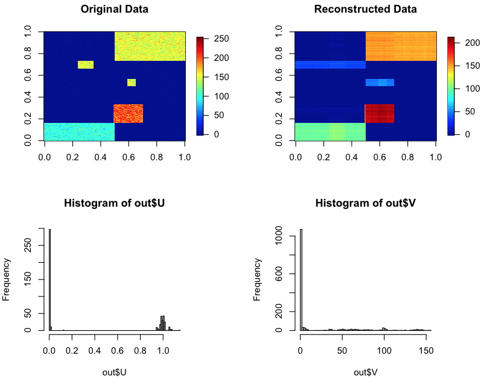

# Summary

Non-negative matrix factorization (NMF) is a widely used algorithm to decompose non-negative matrix data into factor matrices. Due to the interpretability of its non-negativity and the convenience of using decomposition results as clustering, there are many applications of NMF in image processing, audio processing, and bioinformatics [@amari].

We can consider the discrete version of NMF by imposing a binary solution ({0,1}) or ternary solution ({0,1,2}) for the factor matrices. Here, we will refer to these as binary matrix factorization (BMF) or ternary matrix factorization (TMF). It is also possible to apply such a constraint to only one of the two factor matrices, and we will call these (semi-) binary matrix factorization (SBMF) and (semi-) ternary matrix factorization (STMF).

A BMF algorithm was first proposed by Zhang, Z. et al. in 2007 [@bmf], and the algorithm is based on a binary regularization against two factor matrices. Although their work focused on only BMF, the formulization can be applied to TMF, SBMF, or STMF. Besides, there is a growing demand to apply such (semi-) binary or (semi-) ternary decomposition to more heterogeneous non-negative data such as multiple matrices and tensors (high-dimensional arrays), which are higher-order data structures than matrices [@amari]. To meet these requirements, I originally developed \texttt{dcTensor}, which is an R/CRAN package to perform some discrete matrix/tensor decomposition algorithms (\url{https://cran.r-project.org/web/packages/dcTensor/index.html}).

# Statement of need

There is no package to perform (semi-) binary or (semi-) ternary matrix/tensor decomposition. We originally implemented such discrete matrix/tensor decomposition algorithms in R language, which is one of the popular open-source programming languages.

\texttt{dcTensor} provides the matrix/tensor decomposition functions as follows:

- \texttt{dNMF}: Discretized Non-negative Matrix Factorization [@amari; @nmf]
- \texttt{dSVD}: Discretized Gradient Descent Singular Value Decomposition [@svd]
- \texttt{dsiNMF}: Discretized Simultaneous Non-negative Matrix Factorization [@amari; @sinmf1; @sinmf2; @sinmf3]
- \texttt{djNMF}: Discretized Joint Non-negative Matrix Factorization [@amari; @jnmf]
- \texttt{dPLS}: Discretized Partial Least Squares [@pls]
- \texttt{dNTF}: Discretized Non-negative CP Decomposition [@amari; @ntf]
- \texttt{dNTD}: Discretized Non-negative Tucker Decomposition [@amari; @ntd]

# Example

The SBMF and plots in \autoref{fig:sbmf} can be easily reproduced on any machine where R is pre-installed by using the following commands in R:

```r
# Install package required (one per computer)
install.packages("dcTensor")

# Load required package (once per R instance)
library("dcTensor")
library("nnTensor")
library("fields")

# Load Toy data
data <- toyModel("NMF")

# Perform SBMF
set.seed(1234)
out <- dNMF(data, Bin_U=1E+6, J=5)

# Reconstruction of the data matrix
rec.data <- out$U %*% t(out$V)

# Visualization
layout(rbind(1:2, 3:4))
image.plot(data, main="Original Data", legend.mar=8)
image.plot(rec.data, main="Reconstructed Data", legend.mar=8)
hist(out$U, breaks=100)
hist(out$V, breaks=100)
```

{ width=100% }

We can see that the factor matrix $U$ is almost binary, but $V$ is not. This solution is imposed by setting a large value against Bin_U, which is the regularization parameter for $U$.

# Related work

There are some packages to perform BMF, such as \texttt{libmf}, \texttt{recosystem}, and \texttt{Origami.jl}, but there is no package to perform TMF, SBMF, STMF, or the extensions for multiple matrices or tensors except for \texttt{dcTensor}.

# References
